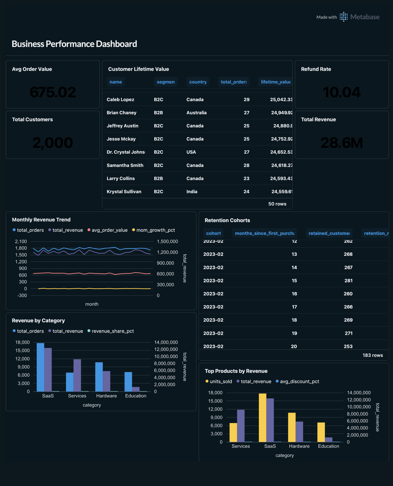

<div align="center">

# Business Performance Dashboard

### Full-Stack Business Intelligence System

[](https://www.python.org/downloads/)
[](https://www.postgresql.org/)
[](https://www.metabase.com/)
[](LICENSE)

**A production-ready business intelligence system featuring a star-schema data warehouse with 50,000+ synthetic transactions, advanced SQL analytics, and interactive KPI dashboards.**

[Quick Start](#quick-start) • [Features](#key-features) • [Documentation](#database-schema) • [Demo](#demo)

</div>

---

## 📊 Demo

<div align="center">



_Complete dashboard showing KPIs, revenue trends, customer lifetime value, retention cohorts, and product performance_

</div>

### Dashboard Highlights

- **KPI Summary Cards**: Total Revenue ($28.6M), Total Customers (2,000), Avg Order Value ($675.02), Refund Rate (10.04%)
- **Monthly Revenue Trend**: Time-series visualization with MoM growth tracking
- **Customer Lifetime Value**: Top 50 customers ranked by total revenue with segment analysis
- **Retention Cohorts**: Month-by-month customer retention analysis showing engagement patterns
- **Revenue by Category**: SaaS leads with $14M+ revenue, followed by Services, Hardware, and Education
- **Top Products**: Revenue breakdown by product with units sold and discount metrics

---

## 📑 Table of Contents

- [Architecture](#architecture)
- [Quick Start](#quick-start)
- [KPI Definitions](#kpi-definitions)
- [Database Schema](#database-schema)
- [Project Structure](#project-structure)
- [Key Features](#key-features)
- [Resume Bullets](#resume-bullets)
- [Troubleshooting](#troubleshooting)
- [License](#license)

---

## 🛠️ Tech Stack

| Category       | Technologies                               |
| -------------- | ------------------------------------------ |
| **Database**   | PostgreSQL 12+                             |
| **Backend**    | Python 3.8+ (psycopg2, Faker, Pandas)      |
| **BI Tool**    | Metabase (Docker)                          |
| **Analytics**  | SQL (Window Functions, CTEs, Aggregations) |
| **Data Model** | Star Schema (Kimball Methodology)          |

---

## 🏗️ Architecture

```
Raw Data → Star Schema (PostgreSQL) → KPI SQL Queries → Metabase Dashboard
```

**Star Schema:**

```
              dim_date
                 │
dim_customers ──fact_orders── dim_products
```

---

## 🚀 Quick Start

> **Total setup time: ~10 minutes** (excluding Docker download)

### Prerequisites

Before you begin, ensure you have the following installed:

- **Python 3.8+** ([Download](https://www.python.org/downloads/))
- **PostgreSQL 12+** (see installation instructions below)
- **Docker** ([Download](https://www.docker.com/products/docker-desktop)) for Metabase
- **Git** (optional, for cloning the repository)

### Setup Instructions

Follow these steps in order to set up the complete dashboard system.

### 1. Install Python dependencies

```bash
pip install psycopg2-binary faker pandas
```

### 2. Setup PostgreSQL

**macOS:**

```bash
brew install postgresql
brew services start postgresql
```

**Ubuntu/Debian:**

```bash
sudo apt install postgresql postgresql-contrib
sudo service postgresql start
sudo -u postgres psql -c "ALTER USER postgres PASSWORD 'postgres';"
```

**Windows:**
Download from [https://www.postgresql.org/download/windows/](https://www.postgresql.org/download/windows/)

### 3. Generate the data warehouse

```bash
# Edit DB_CONFIG in generate.py if your postgres credentials differ
python generate.py
```

This creates the `business_dw` database with:

- **730 date records** (2 years: 2023-2024)
- **2,000 customers** across 7 countries (India, USA, UK, Germany, Australia, Canada, Singapore)
- **12 products** across 4 categories (SaaS, Hardware, Services, Education)
- **50,000 orders** with realistic revenue, discounts, and statuses (85% completed, 10% refunded, 5% pending)

**Expected runtime:** ~30 seconds

### 4. Verify KPI queries

```bash
python kpi_queries.py
```

You should see 5 KPI tables printed in the terminal:

1. Monthly Revenue Trend
2. Revenue by Product Category
3. Customer Lifetime Value (Top 20)
4. Monthly Retention Cohorts
5. Top Products with Running Revenue Total

### 5. Launch Metabase via Docker

```bash
docker run -d \
  -p 3000:3000 \
  --name metabase \
  metabase/metabase
```

Wait ~2 minutes for initialization, then open: **http://localhost:3000**

### 6. Connect Metabase to PostgreSQL

During Metabase setup wizard:

- **Database type:** PostgreSQL
- **Host:** `host.docker.internal` (Mac/Windows) or `172.17.0.1` (Linux)
- **Port:** `5432`
- **Database name:** `business_dw`
- **Username:** your postgres username (default: `postgres` or your system user)
- **Password:** your postgres password

> **Linux users:** Find your Docker bridge IP with `ip route show | grep docker0`

### 7. Build the Dashboard

In Metabase: **New → Question → Native Query**

Paste queries from `metabase_queries.sql`:

| Query        | Chart Type   | Title                                   |
| ------------ | ------------ | --------------------------------------- |
| Query 1      | Line Chart   | Monthly Revenue Trend                   |
| Query 2      | Bar Chart    | Revenue by Category                     |
| Query 3      | Table        | Top Customers by LTV                    |
| Query 4      | Table        | Retention Cohorts                       |
| Query 5      | Bar Chart    | Top Products                            |
| Query 6 (×4) | Metric Cards | Revenue / Customers / AOV / Refund Rate |

**Steps:**

1. Save each query as a "Question"
2. Configure the appropriate visualization type
3. Create **New → Dashboard**
4. Add all saved questions to the dashboard
5. Arrange and resize cards as desired

---

## 📈 KPI Definitions

| KPI                  | Description                                                        | SQL Technique                      |
| -------------------- | ------------------------------------------------------------------ | ---------------------------------- |
| **Monthly Revenue**  | Total revenue grouped by month, completed orders only              | `GROUP BY`, `SUM()`                |
| **MoM Growth %**     | Month-over-month revenue change percentage                         | `LAG()` window function            |
| **Customer LTV**     | Total lifetime revenue per customer, ranked                        | `SUM()` + `RANK() OVER`            |
| **Retention Cohort** | Percentage of customers who return each month after first purchase | CTE + `FIRST_VALUE() OVER`         |
| **Revenue Share**    | Each category's percentage of total revenue                        | `SUM() OVER()`                     |
| **Running Total**    | Cumulative revenue across top products                             | `ROWS BETWEEN UNBOUNDED PRECEDING` |

---

## 🗄️ Database Schema

### Fact Table: `fact_orders`

```sql
order_id      SERIAL PRIMARY KEY
order_date    DATE (FK → dim_date)
customer_id   INT (FK → dim_customers)
product_id    INT (FK → dim_products)
quantity      INT
unit_price    NUMERIC(10,2)
discount      NUMERIC(4,2)
revenue       NUMERIC(10,2)
status        VARCHAR(20)  -- 'completed', 'refunded', 'pending'
```

### Dimension Tables

**`dim_customers`**

```sql
customer_id   SERIAL PRIMARY KEY
name          VARCHAR(100)
email         VARCHAR(100)
country       VARCHAR(50)
city          VARCHAR(50)
segment       VARCHAR(20)  -- 'B2B' or 'B2C'
signup_date   DATE
```

**`dim_products`**

```sql
product_id    SERIAL PRIMARY KEY
product_name  VARCHAR(100)
category      VARCHAR(50)
unit_price    NUMERIC(10,2)
```

**`dim_date`**

```sql
date_id       DATE PRIMARY KEY
year          INT
quarter       INT
month         INT
month_name    VARCHAR(20)
week          INT
day_of_week   VARCHAR(10)
```

---

## 📁 Project Structure

```
├── generate.py             # Creates database, schema, and inserts 50K rows
├── kpi_queries.py          # Runs and prints all 5 KPIs for verification
├── metabase_queries.sql    # Paste-ready SQL queries for each Metabase chart
└── README.md               # This file
```

---

## ✨ Key Features

### Advanced SQL Techniques

- **Window Functions:** `LAG()`, `RANK()`, `FIRST_VALUE()`, `SUM() OVER()`
- **Common Table Expressions (CTEs):** Multi-step cohort analysis
- **Date Functions:** `DATE_TRUNC()`, `TO_CHAR()`, `EXTRACT()`
- **Multi-table Joins:** Star schema fact-dimension relationships
- **Aggregation:** `GROUP BY`, `COUNT()`, `SUM()`, `ROUND()`

### Data Generation

- Realistic distribution: 85% completed, 10% refunded, 5% pending orders
- Temporal patterns: 2 years of historical data
- Geographic diversity: 7 countries
- Product mix: 4 business categories

### Performance Optimization

- Indexed foreign keys on `fact_orders` (date, customer, product)
- Star schema design for analytical queries
- Batch inserts using `execute_batch()`

---

## 🎓 What You'll Learn

This project demonstrates professional-level skills in:

**Data Engineering**

- Star schema data warehouse design and implementation
- ETL pipeline development with Python
- Database optimization with indexes and batch inserts
- Synthetic data generation with realistic business patterns

**SQL & Analytics**

- Advanced window functions (`LAG`, `RANK`, `FIRST_VALUE`, `SUM OVER`)
- Common Table Expressions (CTEs) for complex queries
- Multi-table joins across fact and dimension tables
- Date/time manipulation and cohort analysis

**Business Intelligence**

- KPI definition and metric calculation
- Dashboard design and data visualization
- BI tool integration (Metabase)
- Business analytics storytelling

**DevOps & Tools**

- Docker containerization for BI tools
- PostgreSQL database administration
- Version control best practices
- Documentation writing

---

## 🔧 Troubleshooting

### Connection Issues (Metabase → PostgreSQL)

**Error:** "Connection refused" or "Could not connect to database"

**Solution:**

- **Mac/Windows:** Use `host.docker.internal` as host
- **Linux:** Use `172.17.0.1` or find Docker bridge IP:
  ```bash
  ip route show | grep docker0 | awk '{print $9}'
  ```

### Database Already Exists

If you need to reset the database:

```sql
DROP DATABASE IF EXISTS business_dw;
```

Then re-run `python generate.py`

### Missing Python Packages

Install all dependencies:

```bash
pip install psycopg2-binary faker pandas numpy
```

### Metabase Not Loading

Wait 2-3 minutes after `docker run` for full initialization. Check logs:

```bash
docker logs metabase
```

---

## 🚀 Future Enhancements

Potential improvements to extend this project:

- [ ] Add real-time data streaming with Apache Kafka
- [ ] Implement dbt for transformation layers
- [ ] Add data quality checks and alerting
- [ ] Create predictive models for revenue forecasting
- [ ] Build REST API for dashboard data
- [ ] Add user authentication and role-based access
- [ ] Integrate with cloud data warehouses (Snowflake, BigQuery)
- [ ] Implement CI/CD pipeline for automated testing

---

## 📄 License

MIT License - Feel free to use this project for learning, portfolios, or interviews.

---

## Acknowledgments

Built as a portfolio project demonstrating:

- **Data Warehouse Design:** Kimball methodology with star schema
- **ETL Pipeline Development:** Python + PostgreSQL integration
- **Advanced SQL Analytics:** Window functions, CTEs, complex aggregations
- **Business Intelligence Visualization:** Interactive dashboards with Metabase

---

<div align="center">

### 📮 Feedback & Contributions

Found a bug or have a suggestion? Feel free to [open an issue](../../issues) or submit a pull request!

**Star ⭐ this repo if you found it helpful!**

---

Built with ❤️ for data enthusiasts and aspiring analytics engineers

</div>
